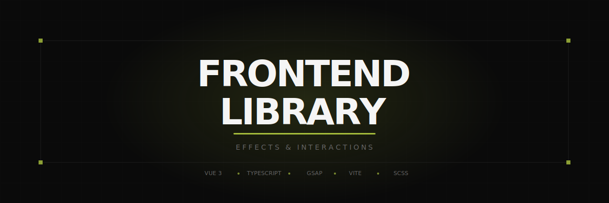

<br/>
<p align="center">
  
</p>

<br/>

<p align="center">
  <strong>A curated collection of stunning frontend effects & interactions.</strong>
  <br/>
  <sub>Built for developers who appreciate craft.</sub>
</p>

<p align="center">
  <a href="#-quick-start"><strong>Quick Start</strong></a> ·
  <a href="#-add-an-effect"><strong>Add an Effect</strong></a> ·
  <a href="#-architecture"><strong>Architecture</strong></a> ·
  <a href="#-contributing"><strong>Contributing</strong></a>
</p>

<br/>

<p align="center">
  
  
  
  
  
</p>

<br/>

---

<br/>

## Overview

**Frontend Library** is an open-source showcase of premium frontend effects; each one a self-contained, production-ready demo you can study, fork, and drop into your own projects.

The landing page itself is designed to be reused by anyone: smooth scroll, split-text animations, mouse parallax, magnetic hover interactions, a custom cursor, film grain overlay, and a preloader, all orchestrated with GSAP.

<br/>

### Landing Page Features

| Feature | Description |
|:--------|:------------|
| **Preloader** | Counter animation 0→100 with progress bar, slides up to reveal content |
| **Split-text hero** | Character-level entrance animation with 3D perspective |
| **Mouse parallax** | Title lines move in opposite directions tracking the cursor |
| **Marquee divider** | Infinite scroll text that accelerates with scroll velocity |
| **Magnetic hover** | Effect titles subtly follow the cursor on hover |
| **Custom cursor** | `mix-blend-mode: difference` dot that scales on interactive elements |
| **Custom scrollbar** | Minimal dot-on-track scrollbar, scales with content length |
| **Film grain** | Canvas-generated noise texture overlay |
| **Smooth scroll** | Lenis smooth scroll synced with GSAP ScrollTrigger |

<br/>

## Quick Start

```bash
# Clone
git clone https://github.com/erazoor/frontend-library.git
cd frontend-library

# Install
pnpm install

# Dev
pnpm dev
```

Open [localhost:5173](http://localhost:5173) and that's it.

<br/>

## Add an Effect

Every effect is a folder inside `src/effects/`. Drop a folder, get a route. Zero config.

### 1. Create the folder

```
src/effects/
└── my-effect/
    ├── index.vue    ← The demo page
    └── meta.ts      ← Metadata (title, tags, tech)
```

### 2. Define metadata

```ts
// src/effects/my-effect/meta.ts
import type { EffectMeta } from '@/types/effect'

export default {
  title: 'My Effect',
  description: 'A brief description of what this effect does.',
  tags: ['scroll', 'parallax'],
  tech: ['GSAP', 'ScrollTrigger'],
  createdAt: '2026-03-15',
} satisfies EffectMeta
```

### 3. Build the demo

```vue
<!-- src/effects/my-effect/index.vue -->
<template>
  <div ref="root" class="effect">
    <h1>My Effect</h1>
  </div>
</template>

<script setup lang="ts">
import { ref } from 'vue'
import gsap from 'gsap'
import { useGsap } from '@/composables/useGsap'

const root = ref<HTMLElement>()

useGsap(() => {
  gsap.from('.effect h1', {
    y: 60,
    opacity: 0,
    duration: 1.2,
    ease: 'power3.out',
  })
})
</script>
```

### 4. Done

Navigate to `/effect/my-effect`, the router picks it up automatically via `import.meta.glob`.

> Prefix a folder with `_` (example: `_draft-effect`) to exclude it from auto-discovery.

<br/>

## Architecture

```
src/
├── assets/scss/           # Design tokens, reset, mixins, typography
├── components/
│   ├── common/            # Cursor, scrollbar, grain, preloader, footer...
│   └── landing/           # Hero, catalog, list items, tags, marquee
├── composables/           # Reusable logic (see below)
├── effects/               # ← Your effects live here
│   └── _template/         # Reference template (excluded from routing)
├── layouts/               # DefaultLayout with global UI layers
├── router/                # Auto-discovered routes
├── types/                 # EffectMeta interface
├── utils/                 # Effects registry (auto-discovery engine)
└── views/                 # Landing page
```

### Composables

| Composable | Purpose |
|:-----------|:--------|
| `useGsap` | Wraps `gsap.context()`, all animations auto-revert on unmount |
| `useLenis` | Singleton smooth scroll instance, synced with ScrollTrigger |
| `useSplitText` | Splits text into `<span>` elements for character/word animation |
| `useMagnetic` | Magnetic hover effect using `gsap.quickTo` |
| `useMousePosition` | Reactive mouse coordinates |

### Auto-Discovery

The effects registry uses Vite's `import.meta.glob` to scan `src/effects/*/`:

- **Metadata** is loaded eagerly (needed at build time for the catalog)
- **Components** are lazy-loaded (code-split per effect route)
- Folders prefixed with `_` are excluded

This means the project scales to hundreds of effects with no manual route registration.

<br/>

## Design System

The project uses a dark-first design language:

```
Background     #0a0a0a
Surface        #1a1a1a
Border         #2a2a2a
Text muted     #666666
Text secondary #a0a0a0
Text primary   #f5f5f5
Accent         #e0ff4f
```

**Typography**: [Syne](https://fonts.google.com/specimen/Syne) (display, 800) · [DM Sans](https://fonts.google.com/specimen/DM+Sans) (body) · [JetBrains Mono](https://fonts.google.com/specimen/JetBrains+Mono) (code)

<br/>

## Scripts

| Command | Description |
|:--------|:------------|
| `pnpm dev` | Start dev server on port 5173 |
| `pnpm build` | Type-check + production build |
| `pnpm preview` | Preview production build locally |

<br/>

## Tech Stack

| Layer | Technology |
|:------|:-----------|
| Framework | Vue 3.5+ with `<script setup>` and TypeScript |
| Build | Vite 6 |
| Animation | GSAP 3 (ScrollTrigger, quickTo, timelines) |
| Smooth Scroll | Lenis |
| Styling | SCSS with design tokens |
| Routing | Vue Router 4 (auto-discovered, lazy-loaded) |
| Deployment | Vercel |

<br/>

## Contributing

Contributions are welcome ! Especially new effects.

1. Fork the repo
2. Create your effect folder in `src/effects/`
3. Follow the [Add an Effect](#-add-an-effect) pattern
4. Open a PR

Please keep effects self-contained. Each effect should work independently without modifying shared code.

<br/>

## License

[MIT](LICENSE) — use it however you want, just keep the attribution.

<br/>

---

<p align="center">
  <sub>A project by <a href="https://pierregineste.dev">Pierre Gineste</a></sub>
</p>
